# Tutorial 2

## Solving ODEs using DifferentialEquations.jl

What it takes to solve an ODE

* Problem
    1. ODE `function(u,p,t)`
    1. Boundary conditions `u0`
    1. Parameters `p`
    1. Time range (for numerics) `(tstart, tend)`
*  Solution
    1. Ansatz / algorithm


Many algorithms for solving ODEs have been implemented in [DifferentialEquations.jl](http://docs.juliadiffeq.org/latest/index.html)

To solve an ODE with DifferentialEquations, first pose the complete ODE problem with `ODEProblem()`.
```
function ode(u,p,t)
  ...
  return(du)
end

u0 = [1. ... ]
p = [1.1 ...]
t = (0.0 10.0) # don't forget the dots!

ode_problem = ODEProblem(ode, u0, t, p)
```


Then solve it with `solve()`
```
solution = solve(ode_problem)
```

## Exercise 0: Install needed packages

Install the packages `DifferentialEquations` and `CSV`.

## Exercise 1: SIR-Models - general exploration


* Implement the ODE of the SIR model as function `sir_ode`

<p align="center"></p>

* Solve the sir_ode for the following parameters and initial conditions

<p align="center"></p>

````julia
using DifferentialEquations, Plots, ParameterizedFunctions
sir_ode = @ode_def begin
  dS = - r * S * I 
  dI =   r * S * I - a * I 
  dR = a *  I
end r a


u0 = [450 550 0.]
p  = [0.1 50]

prob = ODEProblem(sir_ode, u0, 1., p)
sol = solve(prob)

plot(sol)
````


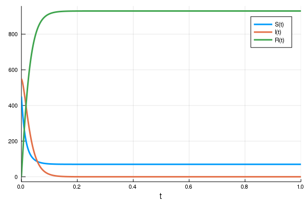


* Plot the solutions in configuration space.
    * Plotting documentation: [DifferentialEquations](http://docs.juliadiffeq.org/latest/basics/plot.html) and [Plots](http://docs.juliaplots.org/latest/).
    * Helpful arguments for the plot function: `vars`, `seriestype`, `linestyle`

* Solve the ode for  and plot the solution in phase space for the variables  and . Interpret the plot.

````julia
r_vec = [0.1:0.05:0.5...]
plot()
for r in r_vec
  p[1] = r
  prob = ODEProblem(sir_ode, u0, 1., p)
  sol = solve(prob)
  display(plot!(sol, vars = (1,2), label = "r = I(t = 0) = 1r"))
end
````


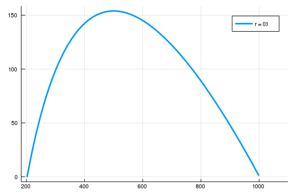
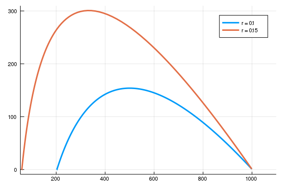
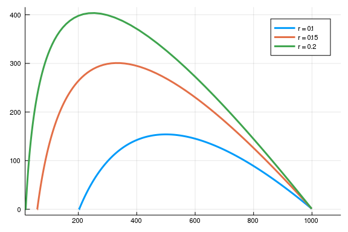
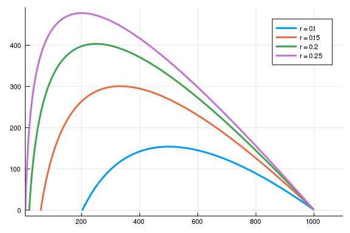
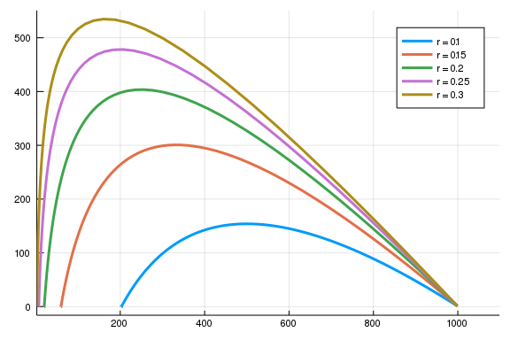
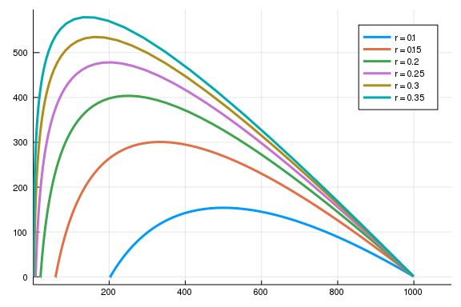
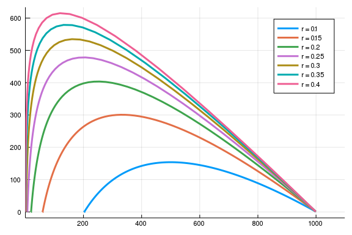
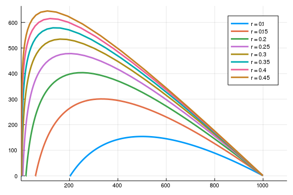
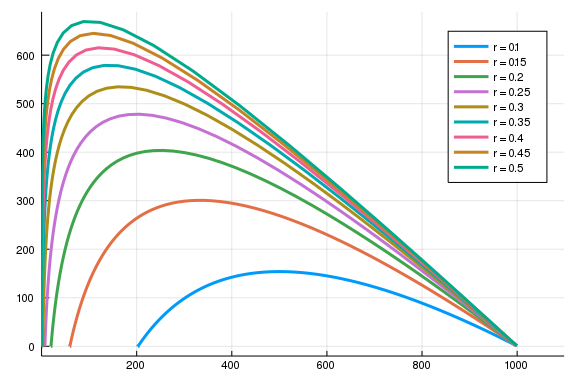


* Simulate the SIR model for  and . What difference would you expect for an epidemic in Manhattan (27.500 citizens per ) and Mongolia (1,7 citizens per )?

````julia
# No outbreak for low density of susceptible subjects
S_vec = 10 .^[2:0.2:3...]
p1 = plot()
p2 = plot()
p3 = plot()
for S in S_vec
  u0 = [S 50 0.]
  p = [0.1 10]
  prob = ODEProblem(sir_ode, u0, 1., p)
  sol = solve(prob)
  plot!(p1, sol, vars = 1, label = "")
  plot!(p2, sol, vars = 2, label = "")
  plot!(p3, sol, vars = 3, label = "")
end
plot(p1,p2,p3, layout = 3)
````


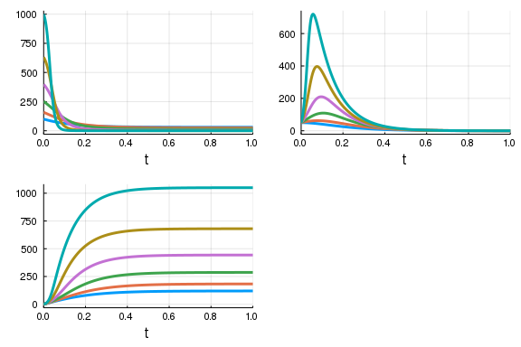


## Exercise 2: Schoolboys dataset

In this exercise, we are going to model the influenza outbreak at the english boarding school in 1978 with the standard SIR model.

1. Find the data in `Data/schoolboys.csv` and plot the number of sick boys vs time
1. From the data, obtain suitable initial conditions `u0` for , ,  and define `tspan` accordingly.
1. Define the parameter vector `p` with guessed parameters
1. Solve the ODE problem and plot it together with data. Does it fit?
1. Play around with the parameters to obtain a better model fit.
    * From the Lecture script, p. 42: $$\rho = a/r ~200$$


## Cathedral exercise

Close to the outside staircase leading to the top panorama platform there are seven huge figures.
During the renovation around 1900 one of the figures was replaced by a figure of the Canon.
What about this fact was so funny for a church representative from Konstanz when he visited
the inauguration ceremony after the renovation?
