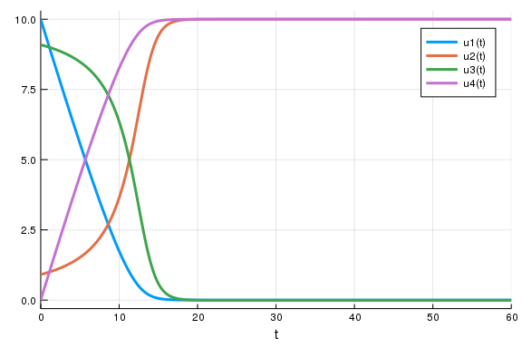
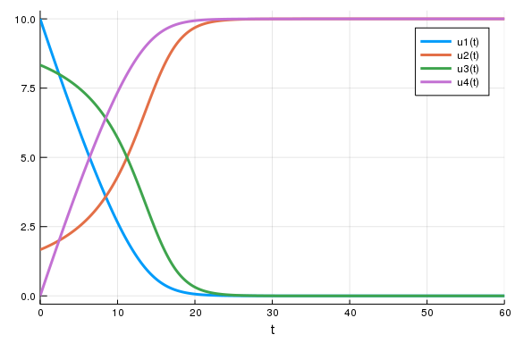

Dynamical Systems in Biology 
============================


Exercise 1: Enzyme dynamics
---------------------------

Implement the enzyme reaction

<p align="center"></p>

-   using mass action kinetics:

<p align="center"></p>

````julia
using DifferentialEquations
using Plots
````


````julia
function ma_ode!(du, u, p, t)
    # p = [kon koff kcat]
    du[1] = - p[1] * u[1] * u[2] + p[2] * u[3] #s
    du[2] = - p[1] * u[1] * u[2] + (p[2] + p[3]) * u[3] #e
    du[3] =   p[1] * u[1] * u[2] - (p[2] + p[3]) * u[3] #c
    du[4] = p[3]*u[3] #p
    return du
end

u0_ma = [10. 10 0 0]'
p = ones(3)  * 0.1
du = zeros(4)
tspan = (0.,60.)
ma_ode!(du, u0_ma, p, 1)
ma_prob = ODEProblem(ma_ode!, u0_ma, tspan, p)
ma_sol = solve(ma_prob)
plot(ma_sol)
````


-   using the steady-state approximation:

<p align="center"></p>

````julia
# ODEs of c and e are obtained via the chain rule:
# c = eT * s / (koff/kon + s) 
# dot{c} = \partial c/partial s * ds/dt (all other partial derivs are zero)
function ssa_ode!(du, u, p, t)
    kon,koff, kcat, eT = p
    s,e,c,p = u
    du[1] =  - koff * eT * s / (koff/kon + s) #s
    du[4] =  -du[1] #p
    # c = eT * s / (koff/kon + s)
    # dcdt = dcds dsdt
    du[3] = (eT * (koff/kon + s) - eT * s) / (koff/kon + s)^2 * du[1] #c
    du[2] = -du[3] #e
    du
end

# eT becomes the fourth parameter
p = [0.1 0.1 0.1 10]
s0 = 10

# Initial conditions for c and e by plugging the initial condition for s into c(s).
c0 = p[4]*s0/(p[2]/p[1] + s0) 
u0_ssa = [s0 p[4]-c0 c0 0]
du_ssa = zeros(4)

tspan = (0.,60.)
ssa_ode!(du_ssa, u0_ssa, p, 1)
ssa_prob = ODEProblem(ssa_ode!, u0_ssa, tspan, p)
ssa_sol = solve(ssa_prob)
display(plot(ssa_sol))
````




````julia

# One could also just have taken the solution to calculate c and e from that.
function ce_ssa(sol_ssa,p,t)
    c = zeros(length(t))
    e = zeros(length(t))
    @. c = p[4] * (sol_ssa(t, idxs = 1)) / ((p[2])/p[1] + sol_ssa(t, idxs = 1))
    @. e = p[4] - c
    [t c e]
end
complexes = ce_ssa(ssa_sol, p, collect(0:0.1:60))
plot!(complexes[:,1], complexes[:,2:3], linewidth = 10)
````


*One big remark is that one has to carefully think about what this solution means.*
*In any case, we lost the mass conservation encoded into the ODEs of the mass-action-kinetics system, which can be seen comparing the following two plots:*


````julia
mysol = ma_sol(collect(0:0.1:60));
display(plot(mysol.t, 
    mysol[1,:].+mysol[3,:].+mysol[4,:], 
    ylims = (9.9,10.1), 
    yticks = 9.9:0.1:10.1))
````


````julia

mysol = ssa_sol(collect(0:0.1:60));
display(plot(mysol.t, mysol[1,:].+mysol[3,:].+mysol[4,:]))
````


-   using the quasi-steady state approximation:

<p align="center"></p>

````julia
function qsa_ode!(du, u, p, t)
    kon,koff, kcat, eT = p
    s,e,c,p = u
    du[1] =  - koff * eT * s / ((koff+kcat)/kon + s) #s
    du[4] =  -du[1] #p
    # c = eT * s / ((koff+kcat)/kon + s)
    # dcdt = dcds dsdt
    du[3] = (eT * ((koff+kcat)/kon + s) - eT * s) / ((koff+kcat)/kon + s)^2 * du[1] #c
    du[2] = -du[3] #e
    du
end

p = [0.1 0.1 0.1 10]
s0 = 10
# Initial conditions for c and e by plugging the initial condition for s into c(s).
c0 = p[4]*s0/((p[2]+p[3])/p[1] + s0) 
u0_qsa = [s0 p[4]-c0 c0 0]
du_qsa = zeros(4)

tspan = (0.,60.)
qsa_ode!(du_qsa, u0_qsa, p, 1)
qsa_prob = ODEProblem(qsa_ode!, u0_qsa, tspan, p)
qsa_sol = solve(qsa_prob)
plot(qsa_sol)
````





1. Simulate the three dynamic systems with parameters , , and . 
    Let the initial concentrations be $(e(0) = 10)$, $(c(0) = p(0) = 0)$, and $(s(0) = 10, 20, 50, 75, 100, 500)$. 
    Other parameters for the simulations are $e_T = e(0) = 10$ and `tspan = (0.0, 60.0).

````julia
p = [0.1 0.1 0.1 10]
tspan = (0.,60.)
s0_values = [10, 20, 50, 75, 100]

ma_sols = Vector(undef, length(s0_values))
ssa_sols =  Vector(undef, length(s0_values))
qsa_sols =  Vector(undef, length(s0_values))

for (s0,i) in zip(s0_values, 1:length(s0_values))
    
    c0_ma = 0 
    u0_ma = [s0 p[4]-c0_ma c0_ma 0]
    ma_prob = ODEProblem(ma_ode!, u0_ma, tspan, p)
    ma_sols[i] = solve(ma_prob)

    c0_ssa = p[4]*s0/((p[2])/p[1] + s0) 
    u0_ssa = [s0 p[4]-c0_ssa c0_ssa 0]
    ssa_prob = ODEProblem(ssa_ode!, u0_ssa, tspan, p)
    ssa_sols[i] = solve(ssa_prob)
    
    c0_qsa = p[4]*s0/((p[2]+p[3])/p[1] + s0) 
    u0_qsa = [s0 p[4]-c0_qsa c0_qsa 0]
    qsa_prob = ODEProblem(qsa_ode!, u0_qsa, tspan, p)
    qsa_sols[i] = solve(qsa_prob)

end

# doesnt yet work...
# myplot = plot(layout = 4)
# for (ma, ssa,qsa) in zip(ma_sols, ssa_sols, qsa_sols)
#     s = plot(ma, vars = 1);
#     e = plot(ma, vars = 2);
#     c = plot(ma, vars = 3);
#     p = plot(ma, vars = 4);
#     
#     s = plot!(s, ssa, vars = 1);
#     e = plot!(e, ssa, vars = 2);
#     c = plot!(c, ssa, vars = 3);
#     p = plot!(p, ssa, vars = 4);
#     
#     s = plot!(s, qsa, vars = 1);
#     e = plot!(e, qsa, vars = 2);
#     c = plot!(c, qsa, vars = 3);
#     p = plot!(p, qsa, vars = 4);
# 
#     display(plot!(myplot, plot(s,e,c,p)))
# end

# substrate: you can see that the initial conditions don't really match since I didn't take into account that at the beginning, some of the substrate is sequestered into the complex.
# However, the linear decrease is well matched for high substrate concentrations.
plot()
for (ma, ssa,qsa) in zip(ma_sols, ssa_sols, qsa_sols)
    plot!(ma,  vars = 1)
    plot!(ssa, vars = 1, linestyle = :dot)
    plot!(qsa, vars = 1, linestyle = :dash)
end
display(plot!())
````


````julia

# complex: The approximations assume that complexes are created instantaneously whereas it has to be created first in the more realistic (for the initial phase) mass-action setting.
plot()
for (ma, ssa,qsa) in zip(ma_sols, ssa_sols, qsa_sols)
    plot!(ma,  vars = 3, color = :red)
    plot!(ssa, vars = 3, linestyle = :dot, color = :green)
    plot!(qsa, vars = 3, linestyle = :dash, color = :blue)
end
display(plot!())
````


1. Take a closer look at the initial time frame of the full system implemented by mass-action kinetics. What do you observe?

````julia
# Apparently, the substrate is consumed quickly, but this is only due to complex formation. 
# Product formation only starts slowly and then goes into the linear phase.
plot(ma_sol, tspan = (0.,5.))
````


1. Have a look at the dynamics of all implementations in phase space  vs. .

````julia
# Again we observe that the approximations already start with ready-made complexes
plot(ma_sol, vars = (1,3), color = :red, xlabel = "e", ylabel = "c")
plot!(ssa_sol, vars = (1,3), color = :green)
plot!(qsa_sol, vars = (1,3), color = :blue)
````


Exercise 2: Homework
---------------------------

In this exercise, we wish to determine  and  with the help of a *Lineweaver-Burk-Plot*.
Those are described in the Script, p.107 and on https://en.wikipedia.org/wiki/Lineweaver%E2%80%93Burk_plot 


1. Using the implementation of the mass-action-kinetics ODE, create a Lineweaver-Burk-Plot and determine Vmax and Km from it. Substeps:
    * Simulate the mass-action-kinetics ODE  with the parameters from above and for $s(0) = 100$.
    * Plot $frac{1}{V} = \frac{1}{\dot{p}}$ vs $\frac{1}{s}$ 
    * Determine $Vmax$ and $K_m$ from the plot.
    


Cathedral exercise:
-------------------

On the historic depiction of the cathedral on a control box in front of
the Hof-Apotheke, corner KaJo / Münsterstrasse, one can see that four
steps lead to the main portal of the minster. Why is it only one today?


\* Pro bug catcher at the English Wikipedia \[CC BY-SA 3.0 \http://creativecommons.org/licenses/by-sa/3.0/\)\]
