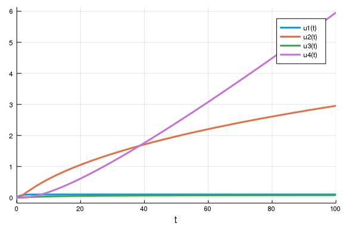

# Tutorial 6

A short note on derivatives in scientific programming
---------------------------

* Derivatives are very important for a lot things
    * Efficient optimization
    * Sensitivity analysis
    * Today: Control theory

**Ways to obtain derivatives**

* Code them manually
    * Possible for simple cases, potentially also automizable through computer algebra systems (Mathematica, sympy, yacas)
    * Try to avoid that
* ODEs: Sensitivity Equations 
    * Reason: Integrator algorithms choose their step sizes according to the problem to minimize the numerical integration error
        * Different parameters -> different step sizes -> different errors -> with finite differences this leads to catastrophic errors and your derivs will be just rubbish
    * Idea: Just integrate the derivatives along with the ode itself:
    * Usually much more efficient, since you can take advantage of sparsity
    * In DifferentialEquations.jl: `ODELocalSensitivityProblem`
$$
\begin{aligned}
    \frac{d}{dt} u &= f(u,p) \\
    \frac{d}{dt} \frac{\partial u}{\partial p} &= \partial_u f \partial_p x + \partial_p f
\end{aligned}
$$

* Finite differences 
    * Difference quotient with finite $ h $ 
    * Higher order derivatives possible by iterative derivation, e.g. https://en.wikipedia.org/wiki/Discrete_Laplace_operator and https://github.com/JuliaDiffEq/DiffEqOperators.jl
    * They are ok for quick checks or as last resort, but better avoid them in "real problems"
    * `FDM.jl` for some more sophisticated implementations
$$
\partial_x f = \frac{f(x) - f(x+h)}{h} + \mathcal{O}(h^2)
$$

* Complex-step derivatives
    * Are like finite-differences but with the advantage that there is no truncation error
    * https://en.wikipedia.org/wiki/Numerical_differentiation#Complex-variable_methods 

* Adjoint sensitivities 
    * For problems consisting of scalar valued function `obj(x(p))` + constraint `constr(x,p) = 0`
    * obtain gradient of f without calculating the model sensitivities themselves
    * Best for systems with many parameters
    * More here https://cs.stanford.edu/~ambrad/adjoint_tutorial.pdf


* Algorithmic / automatic differentiation
    * Let the programming language do the work
    * Idea: Propagate derivatives through the function via chain rule
    * Good example on https://en.wikipedia.org/wiki/Automatic_differentiation
    * Very efficient for some problems and very convenient
    * Drawback: Implementation easiest if all functions are implemented in the same language
    * This is ** *the* ** reason why to use julia.


Exercise 1: Enzyme reaction chain
---------------------------------

Consider a chain of Michaelis-Menten enzyme reactions:

$$ 
S \stackrel{E_{1}}{\longrightarrow} S_{1}
\stackrel{E_{2}}{\longrightarrow} S_{2}
\stackrel{E_{3}}{\longrightarrow} S_{3}
\stackrel{E_{4}}{\longrightarrow} P 
$$

for a constant concentration $S=1$ and given
$V_{max}$ and $K_{M}$
values:

$$ 
\begin{aligned} 
      &V_{max} &  K_{M} \\ 
E_{1} &0.1 & 0.1 \\ 
E_{2} &1.0 & 1.0 \\ 
E_{3} &1.0 & 0.1 \\ 
E_{4} &5.0 & 5.0 
\end{aligned}
$$

-   You can copy the following code:

````julia
using DifferentialEquations, Plots

function enzyme_ode!(du, u, p, t)
    S1, S2, S3, P = u
    S, v0,  v1, v2,  v3, K0, K1, K2, K3 = p 

    dS1 = v0*S /(K0 + S ) - v1*S1/(K1 + S1)
    dS2 = v1*S1/(K1 + S1) - v2*S2/(K2 + S2)
    dS3 = v2*S2/(K2 + S2) - v3*S3/(K3 + S3)
    dP  = v3*S3/(K3 + S3)
    
    du[:] = [dS1, dS2, dS3, dP]
end

u0 = zeros(4) #[S1, S2, S3, P]
p = [1 0.1 1 0.1 5 0.1 1 1 5] #[S, v0, K0, v1, K1, v2, K2, v3, K3]

tspan = (0., 100.)
prb = ODEProblem(enzyme_ode!, u0, tspan, p)
sol = solve(prb)

plot(sol)
````





-   Determine the steady state concentrations $S_{1}, S_{2}$ and $S_{3}$ and the steady state flux $ J = \dot{P}|_{\text{steady state}} $ by simulating the system for long time periods.

````julia
prb = ODEProblem(enzyme_ode!, u0, (0.,1e10), p)
sol = solve(prb)

print(last(sol))
````


````
[0.1, 10.0, 0.0925926, 9.09091e8]
````


````julia

plot(sol)

enzyme_ode!(zeros(4), last(sol), p, 0)
````


````
4-element Array{Float64,1}:
  0.0                  
 -4.163336342344337e-17
  5.551115123125783e-17
  0.0909090909090909
````


- Have a look at the function `SteadyStateProblem` and use it to
  calculate the steady state concentrations of the enzymes $S_1$, $S_2$ and $S_3$ without simulating the system
  How does this work i.e. what's the math behind it (think back to the very first tutorial)?

````julia
using ParameterizedFunctions
ei = @ode_def begin
    dS1 = v0*S /(K0 + S ) - v1*S1/(K1 + S1)
    dS2 = v1*S1/(K1 + S1) - v2*S2/(K2 + S2)
    dS3 = v2*S2/(K2 + S2) - v3*S3/(K3 + S3) 
end S v0  v1 v2  v3 K0 K1 K2 K3

p = [1 0.1 1 0.1 5 0.1 1 1 5] #[S, v0, K0, v1, K1, v2, K2, v3, K3]

ei(zeros(3), p, 1.)
steady_prob = SteadyStateProblem(ei, zeros(3), p)
steady_sol = solve(steady_prob)
````


````
u: 3-element Array{Float64,1}:
 0.1               
 9.999999999721467 
 0.0925925925925926
````


- Use the steady-state solution of the substrates to calculate the flux

````julia
enzyme_ode!(zeros(4), [steady_sol.u... 0], p, 0.1)[4]
````


````
0.09090909090909093
````


-   Calculate the control coefficients $\frac{\partial \log S_{steady}}{\partial \log p}$ and $\frac{\partial \log J}{\partial \log p}$ using `ForwardDiff.jl`.
    * Look at: http://docs.juliadiffeq.org/latest/analysis/sensitivity.html#Examples-using-ForwardDiff.jl-1

````julia
using ForwardDiff

function enzyme_ode!(du, u, p)
    S1, S2, S3, P = u
    S, v0,  v1, v2, v3, K0, K1, K2, K3 = p 

    du[1] = v0*S /(K0 + S ) - v1*S1/(K1 + S1)
    du[2] = v1*S1/(K1 + S1) - v2*S2/(K2 + S2)
    du[3] = v2*S2/(K2 + S2) - v3*S3/(K3 + S3)
    du[4]  = v3*S3/(K3 + S3)
    
    du
end

u0 = [steady_sol... 0] #[S1, S2, S3, P]
p = [1 0.1 1 0.1 5 0.1 1 1 5] #[S, v0, K0, v1, K1, v2, K2, v3, K3]

tspan = (0., 1e10)
prob = ODEProblem(enzyme_ode!, u0, tspan, p)
sol = solve(prob)

function sj(lp)

  p = exp.(lp)
  _prob = remake(prob;u0=convert.(eltype(p),prob.u0),p=p)
  # steady state concentrations and flux
  #substrates
  substrates = solve(_prob, save_everystep=false)[end][1:3]
  #flux
  S1, S2, S3 = [substrates...]
  S, v0,  v1, v2, v3, K0, K1, K2, K3 = p 
  flux = v3*S3/(K3 + S3)
  
  log.([substrates... flux])
end

lp = log.(p)
derivs = ForwardDiff.jacobian(sj,lp)
````


````
Error: MethodError: no method matching Float64(::ForwardDiff.Dual{ForwardDi
ff.Tag{typeof(Main.WeaveSandBox5.sj),Float64},Float64,9})
Closest candidates are:
  Float64(::Real, !Matched::RoundingMode) where T<:AbstractFloat at roundin
g.jl:194
  Float64(::T<:Number) where T<:Number at boot.jl:741
  Float64(!Matched::Int8) at float.jl:60
  ...
````


- Plot the control coefficients: Which parameters have the highest control over which variables? 

````julia
using DataFrames, DataFramesMeta, Gadfly
parsymbols = [:S, :v0,  :v1, :v2, :v3, :K0, :K1, :K2, :K3]
df =  DataFrame(derivs', [:S1, :S2, :S3, :J1])
````


````
Error: UndefVarError: derivs not defined
````


````julia
df =  @transform(df, par = parsymbols)
````


````
Error: UndefVarError: df not defined
````


````julia
df = stack(df, [1:4;])
````


````
Error: UndefVarError: df not defined
````


````julia
Gadfly.plot(df, x = :par, y = :value, xgroup = :variable, color = :par, Geom.subplot_grid(Geom.bar))
````


````
Error: UndefVarError: df not defined
````


# Homework

* One at a time, increase each parameter by 10% and evaluate its effect on $\log J$
* Implement the control coefficients with finite differences, evaluate the control coefficients for different `h = [10. ^x for x in -16:0]`, determine the order magnitude of `h` where the derivatives become numerically instable.


Cathedral exercise:
-------------------

Why is the cathedral tower at the bottom foursided while being octagonal
at the top?
