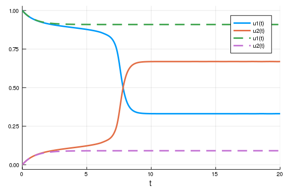
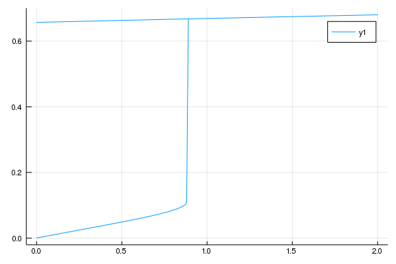
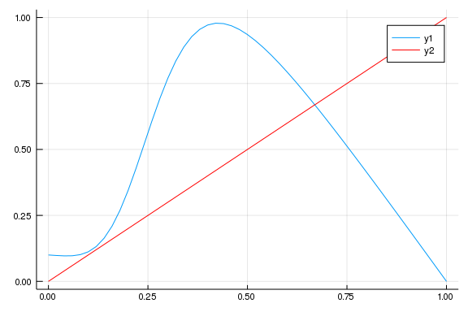
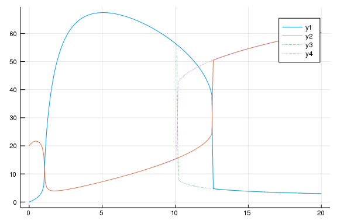

# Tutorial 7

# Exercise 1: Positive cooperative feedback

Consider a protein $A$ being phosphorylated by a stimulus $S$ with rate $k_1$ and dephosphorylated with rate $k_{-1}$. The phosphorylation is cooperatively enhanced by a positiv feedback with hill coefficient $k=4$ and rate $k_2$:

$$ 
\frac{\mathrm{d}}{\mathrm{d}t} pA = k_{1} \cdot S \cdot A + k_{2} \cdot A \cdot \frac{pA^4}{K_{m}^4 + pA^4} - k_{-1}\cdot pA. 
$$

Further assume that the total amount of protein equals 1 ($pA + A = A_{\mathrm{total}} = 1$):

$$ 
\frac{\mathrm{d}}{\mathrm{d}t} pA = \left( k_{1} \cdot S + k_{2} \cdot \frac{pA^4}{K_m^4 + pA^4}\right) \cdot (1-pA) - k_{ -1}\cdot pA. 
$$

The parameters are given by $k_{1} = 0.1$, $k_{-1} = 1$, $k_{2} = 2$ and $K_{m} = 0.3$.


* Use the following system for the exercises
````julia

using DifferentialEquations, Plots

function feedback!(du, u, p, t) 
    A, pA = u
    S, k1, k_1, k2, Km = p
    du[2] = (k1*S+k2*pA^4/(Km^4 + pA^4))*(1-pA) - k_1*pA
    du[1] = -du[2]
    return du
end

p =  [1 0.1 1 2 0.3] # S, k1, k_1, k2, Km
u0 =  [1. 0] # A, pA 
tspan = (0, 20.)

prob = ODEProblem(feedback!, u0, tspan, p)
sol = solve(prob)
````


* Compare the solution with the solution without a positive feedback.
````julia
using DifferentialEquations, Plots

function feedback!(du, u, p, t) 
    # A and pA are actually functionally related via mass conservation
    # \dot{A}+\dot{pA} = 0 -> A+pA = const
    A, pA = u
    S, k1, k_1, k2, Km = p
    du[2] = (k1*S+k2*pA^4/(Km^4 + pA^4))*A - k_1*pA
    du[1] = -du[2]
    return du 
end

function feedback2!(du, u, p, t) 
    # Here, I put in already the mass conservation
    #   by setting A+pA=1 --> A = 1-pA in the du[2] expression
    # I only keep A as a state because I'm too lazy to write a function 
    #   which takes the solution of \dot{pA} as input and returns A
    A, pA = u
    S, k1, k_1, k2, Km = p
    du[2] = (k1*S+k2*pA^4/(Km^4 + pA^4))*(1-pA) - k_1*pA
    du[1] = -du[2]
    return du
end

# .. With feedback
p =  [1 0.1 1 2 0.3] # S, k1, k_1, k2, Km
u0 =  [1. 0] # A, pA 
tspan = 20.

prob = ODEProblem(feedback!, u0, tspan, p)
sol = solve(prob)
# For the tutorial: in this solution, the adaptive step-size of the solver algorithm can nicely be seen

# .. Without feedback
p_nofb =  [1 0.1 1 0 0.3] # S, k1, k_1, k2, Km
u0 =  [1. 0] # A, pA 
tspan = (0, 20.)

prob_nofb = ODEProblem(feedback!, u0, tspan, p_nofb)
sol_nofb = solve(prob_nofb)

plot(sol)
plotattr("linestyle")
````


````
linestyle {Symbol}
linestyles, ls, s, style

Style of the line (for path and bar stroke).  Choose from Symbol[:auto, :so
lid, :dash, :dot, :dashdot, :dashdotdot]
Series attribute,  default: solid
````


````julia
plot!(sol_nofb, linestyle = :dash)
````





* Compute the system's steady state (see last tutorial) and run a quick consistency check that the results make sense. 
    (If they don't, choose another method to compute the steady states or tune the hyperparameters to obtain more meaningful results.)


* Write a function `tune_input(f, u0, input, p)` for the following task
    Stimulate the system with input `S in [0,2]` starting with `S = 0` , increasing `S` in small steps until `S = 2` and then reducing `S` in small steps until `S = 0` again. 
    In each step, compute the steady state of the system and take its value as initial value for the next `S` value. Start with `pA=0` for `S=0`.
    * Plot `pA` vs `S`.
    * How is the observed phenomenon called in physics?
    * What is its meaning in biological systems? 
    * Run with k2 = 0.8

````julia
prob_ss = SteadyStateProblem(feedback!, u0, p)
sol_ss = solve(prob_ss, DynamicSS(Tsit5(), tspan = 1e5), 
    reltol = 1e-16, abstol = 1e-16, save_everystep = false)[end]
feedback!(zeros(2), sol_ss, p, .1)

sol_ss = solve(prob_ss, SSRootfind(), reltol = 1e-16, abstol = 1e-16)
feedback!(zeros(2), sol_ss, p, .1)

prob = ODEProblem(feedback!, u0, 1e2, p)
sol = solve(prob, save_everystep = false)[end]
feedback!(zeros(2), sol, p, .1)

# quick check if it works for p=0
prob = ODEProblem(feedback!, u0, 1e2, [0 p[2:end]...])
sol = solve(prob)
feedback!(zeros(2), sol[end], p, .1)

function tune_input(f, u0, input, p)
    # ensure that the right prob is chosen
    prob = ODEProblem(f, u0, 1e10, p)
    # preassign output matrix of inputs and steady state pA values
    out = zeros(length(input), length(prob.u0)+1)
    out[:,1] = input
    u0 = copy(u0)
    for (i,j) in zip(input, 1:length(input))
        p = [i prob.p[2:end]...]
        prob = remake(prob, u0 = u0, p = p)
        #println(feedback!(zeros(2), sol, p, .1))
        out[j,2:end] = u0[:] = solve(prob)[end]
    end
    out
end

u0 =  [1. 0] # A, pA 
input = [0:0.01:2... reverse([0:0.01:2...])...]
outputs = tune_input(feedback!, u0, input, p)
plot(outputs[:,1], outputs[:, end])
````





* Generate a rate balance plot to illustrate the mode of action: plot the build and decay fluxes of $pA$ as a function of $pA$.
````julia
function fb_rates(pA,p)
    S, k1, k_1, k2, Km = p
    [(k1*S+k2*pA^4/(Km^4 + pA^4))*(1-pA); k_1*pA]
end

rates = hcat([fb_rates(x,p) for x in 0:0.02:1]...)
plot(0:0.02:1, rates[1,:])
plot!(0:0.02:1, rates[2,:], color = :red)
````





*   How can you extract information on the qualitative dynamics, especially the stability of the fixed points, from this plot?

*Blue crossing from above: stable fixed point, blue crossing from below, instable fixed point.*

* Evaluate the system for smaller values of $k_2$ and discover another, qualitatively different behavior of the system. How can this behavior be explained?
````julia
p =  [1 0.1 1 0.8 0.3] # S, k1, k_1, k2, Km

function fb_rates(pA,p)
    S, k1, k_1, k2, Km = p
    [(k1*S+k2*pA^4/(Km^4 + pA^4))*(1-pA); k_1*pA]
end

rates = hcat([fb_rates(x,p) for x in 0:0.02:1]...)
plot(0:0.02:1, rates[1,:])
plot!(0:0.02:1, rates[2,:], color = :red)
# stable fixed point at pA ~ 0.1, 0.4, instable fixed point at pA ~ 0.2
````


.

# Exercise 2

This model of a gene regulatory network was taken from [here](https://journals.plos.org/plosone/article?id=10.1371/journal.pone.0003478#pone-0003478-g002)


* If you have time, read the first few paragraphs of the introduction

Assume this model describes a stem cell which is about to differentiate into one of two possible phenotypes (e.g. a skin cell or a muscle cell).
To know, which cell type this cell has to choose, it processes the external information provided by the ratio of two biochemicals $O$ and $S$. 
In this model, the ratio is given as parameter `O_by_S == p[1]`.

* Use your `tune_input` function from exercise 1 to find two different phenotypes (steady states) depending on the input. For reasonable ranges of the input, browse the paper)
* What is the biological meaning of the region of bistability (i.e. a range of inputs with two stable steady states)? 

````julia
function model2!(du, u, p, t)
    N, G = u
    O_by_S,    a1,a2,b1,b2,b3,γ_n,c1,c2,d1,d2,d3,γ_g = p
    du[1] = (a1*O_by_S + a2*O_by_S * N) / (1 + b1*O_by_S + b2*O_by_S*N + b3*O_by_S*G) - γ_n * N
    du[2] = (c1*O_by_S + c2*G) / (1 + d1*O_by_S + d2*G + d3*N) - γ_g * G
end
# p2 =O_by_S  a1  a2    b1  b2    b3  γ_n  c1   c2   d1   d2   d3  γ_g
p2 = [1       .02 .0125 .02 .0125 .03 .01  .05 .0125 .05 .0125 .05 .01]
u2 = ones(2)
````


````
2-element Array{Float64,1}:
 1.0
 1.0
````


````julia
prob2 = SteadyStateProblem(model2!, u2,p2)
 sol2 = solve(prob2)
# * solve for steadyy states in dependence of O_by_S
input2 = [0:0.1:20... ]
outputs2 = tune_input(model2!, u2, input2, p2)

u3 = outputs2[end, 2:3]
input3 = reverse([9:0.1:20...])
outputs3 = tune_input(model2!, u3, input3, p2)

plot(outputs2[:,1], outputs2[:, 2:end])
plot!(outputs3[:,1], outputs3[:,2:end], linestyle = :dot)
````





Cathedral exercise:
-------------------
What is the story of the most famous waterspout?
